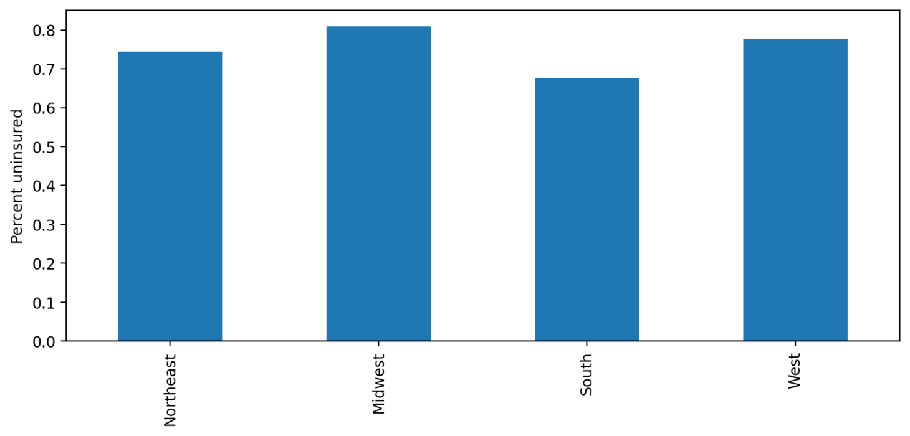
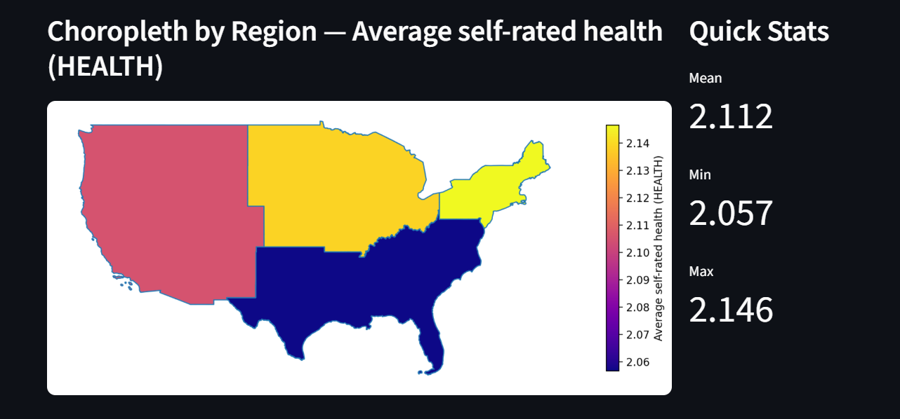

# Introduction

Disparities in health outcomes resulting from inequitable access to healthcare remains a distinct and persistent issue across the United States. These differences vary significantly by geographic region, as well as by demographic factors such as race, socioeconomic status, education level and more. Understanding these trends across different regions and populations is critical for informing public policy and designing healthcare interventions that will address the impact these gaps in the U.S. healthcare system have on the most vulnerable communities.

This project analyzes regional variation in health outcomes using data from the National Health Interview Survey (NHIS). 

The primary research question guiding this project is:

**How do insurance coverage and self-reported health outcomes vary across U.S. regions and demographic groups?**

To explore this question, we combine microdata from the NHIS with geographic data representing U.S. Census regions. The analysis examines how insurance coverage, poverty levels, and self-reported health status vary across regions and demographic categories such as race, education, and socioeconomic circumstances.

The project showcases the trends using 3 different visualizations through an interactive Streamlit dashboard that allows users to make observations in a dynamic manner.

# Data

This project uses two primary datasets.

## NHIS Microdata

Firstly, we sourced data from the National Health Interview Survey (NHIS) as part of the larger IPUMS Health Surveys database. NHIS is a nationally representative survey conducted by the National Center for Health Statistics that collects information on health status, health care access, and demographic characteristics of individuals in the United States.

We primarily focused on the following variables in our analysis:

- `REGION` — Census region of residence
- `RACENEW` — Self-reported race (post-1997 OMB standards)
- `SEX` — Respondent's sex
- `EDUC` — Education attainment of respondent
- `POVLEV` — Household income relative to the federal poverty line (displayed as a ratio)
- `HEALTH` — Respondent's self-reported health status
- `HINOTCOV` — Indicator variable detailing whether the respondent has health insurance coverage or not.
- `USUALPL` — Binary indicator of whether the respondent has a usual place for medical care
- `DELAYCOST` — Whether care was delayed due to cost

Survey weights (`SAMPWEIGHT`) are used to compute weighted regional statistics to better represent the national population through the compiled dataset.

## Geographic Data

The second dataset consists of geographic boundary data for U.S. states drawn from TIGER to map outcomes across the country. To merge the two datasets, health survey data was aggregated to the Census region level and categornized into the following four regions: Northeast. Midwest, South, and West.

# Data Processing

Before analysis could be conducted, several pre-processing steps were necessary to clean and standardize the data. Due to the nature of the NHIS data, which includes a mix of numeric and categorical variables, we had to ensure that all variables were appropriately formatted for analysis and visualization. Certain  numeric variables, such as educational attainment, were recoded into categorical values, and binary indicators such as health insurance coverage were recoded to contain a value of either 0 or 1 to facilitate easier interpretation and analysis.

Income levels were categorized using the `POVLEV` variable from NHIS, which is used to measure household income relative to the federal poverty line. This measure was aas aggregated using the poverty line as a threshold, resulting in categories of: Below the poverty line; Near-poor households, and; Middle-income households.

Finally, survey weights were then applied for calculating summary statistics to produce population-representative estimates.

## Regional Uninsurance Rates

The first figure shows the percentage of individuals without health insurance across the four Census regions. Although the differences may not appear significant initially, the results indicate that the rates of uninsured individuals vary substantially when compared across the regions. In particular, average rates of uninsured individuals are especially high in the South at nearly 0.1%, whereas the Northeast generally shows lower rates of uninsurance around 0.04% on average. These differences most likely reflect variation in economic conditions, demographic composition, and policy environments across the respective regions.

## Regional Map of Health Outcomes

The second visualization is a spatial map displaying regional variation in selected health metrics. By aggregating survey data to the Census region level and joining these values to geographic boundary data, the map highlights geographic disparities in health indicators.

# Interactive Dashboard

To better showcase the impact of each variable on health insurance coverage rates and how each changes in relation to each other, we developed an interactive dashboard with the following features:

- Filters for region, race, income level, education level, and insurance status
- A choropleth map displaying regional health statistics
- A searchable table summarizing regional statistics
- A Region Detail View that displays weighted summary statistics for a selected region
- Interactive charts showing distributions of insurance coverage and other variables

Users can apply these filters to explore trends and the relationships between each variable, as well as their relative effects on healthcare access. For example, users can examine how insurance coverage varies across income groups or how self-reported health differs across regions, or otherwise investigate patterns that may not be immediately visible in a single figure.

# Limitations

Several limitations had to be reconciled in regard to compiling this project and interpreting the final results. First, this analysis used cross-sectional survey data, meaning it reflects conditions at the specific point of 2024, rather than any gradual changes over time. As a result, this analysis should not be used to determine causal relationships between variables. Second, the analysis aggregated individuals into broad geographic regions as a result of the NHIS data being stratified as such. While this seemingly simplifies interpretation to an extent, this also prevents us from noting deeper and more important variation within regions at the state or county level. Third, all the survey responses relied on self-reported responses, such as health status, which potentially introduces reporting bias. Finally, although survey weights are used to mitigate any issues with representation of the population, other aspects of complex survey design that we were hoping to replicate from previous assignments and classes, such as clustering and stratification, were not fully incorporated in this analysis.

# Conclusion

This project examined regional disparities in health insurance coverage and self-reported health outcomes using data from the National Health Interview Survey and TIGER. The results suggest that, although the differences are small across the regions, there is a considerable degree of variation that exists across regions in measures such as insurance coverage and health status, relative between each region. Socioeconomic factors such as income and education also appear to play an important role in shaping behaviors that ultimately influence health outcomes. Future policy regarding healthcare within the United States should still prioritize mitigating the difference in ease of attaining optimal health outcomes across the regions, regardless of whether or not the actual quantitative differences among the regions can be perceived as miniscule.